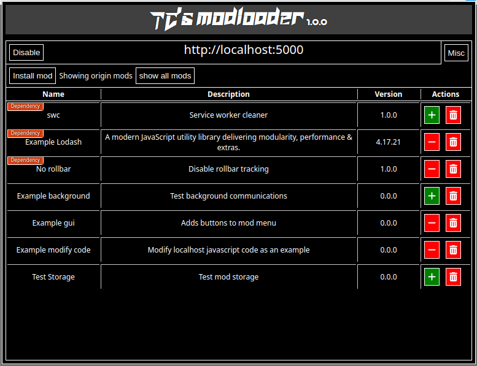
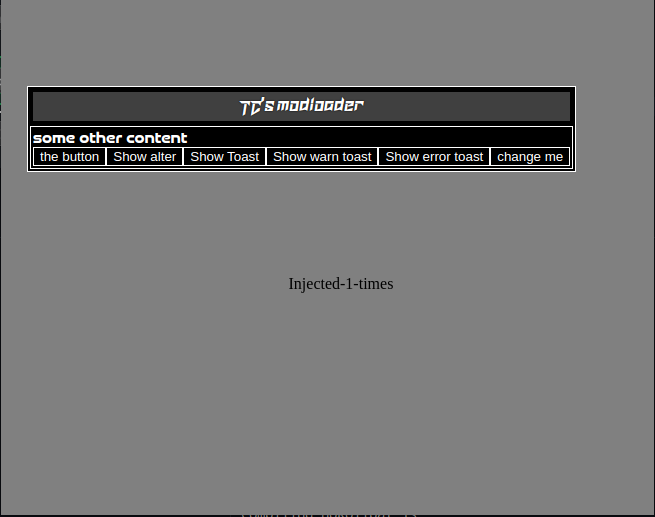

<center>
    </img>
</center>

# TC's mod-loader
`TC's mod-loader` is a state-of-the-art web-browser-based mod loader capable of modifying websites running scripts. Exposing webpage context to the running mod. It also gives mods ability to use browser background script making them really powerful. 
<center>
    </img>
    </img>
</center>

## Safety?
With great power comes great responsibility. You should never trust mods that you found online. The mod-loader does only provides basic protection against malicious mods.

## build
```
npm install
npm run dev #dev build
npm run build
```

## Make mods
```
cd mod-builder
npm install
npm run build
```